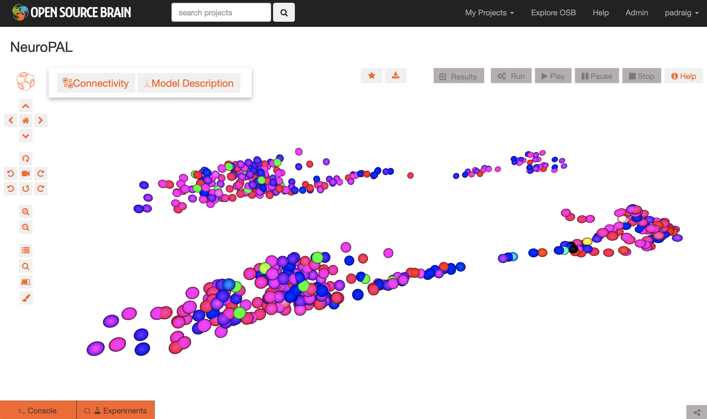

# NeuroPAL

This repository contains some test scripts which use the NeuroPAL datasets.

# Head and tail datasets

The original publication on NeuroPAL was: Eviatar Yemini, Albert Lin, Amin Nejatbakhsh, Erdem Varol, Ruoxi Sun, Gonzalo E. Mena, Aravinthan D.T. Samuel, Liam Paninski, Vivek Venkatachalam, Oliver Hobert, <b>NeuroPAL: A Multicolor Atlas for Whole-Brain Neuronal Identification in <i>C. elegans</i></b>,
[Cell, Volume 184, Issue 1, 2021](https://doi.org/10.1016/j.cell.2020.12.012).

The dataset released with this publication on positions and colors (as used in Figures 2 and 7) of cells in the head and tail has been used in [this Jupyter notebook](TestLoadingData.ipynb), and extracted from the Excel sheet, and converted to NeuroML format.

<i>The above image shows the data <a href="https://www.opensourcebrain.org/projects/neuropal/repository/revisions/main/show/NeuroML2?explorer=https%253A%252F%252Fraw.githubusercontent.com%252Fopenworm%252FNeuroPAL%252Fmain%252FNeuroML2%252FNeuroPAL_Herm_Male.net.nml">visualised on Open Source Brain</a>, with the data from the male worm shown in front (head to left, tail to right, shifted to be adjacent), and the equivalent hermaphrodite data behind.</i>

# Whole body datasets

Updated data has been provided by Michael Skuhersky <on the whole body cell positions and colors. Conversion of this data can be seen [here](TestWholeWorm.ipynb).
